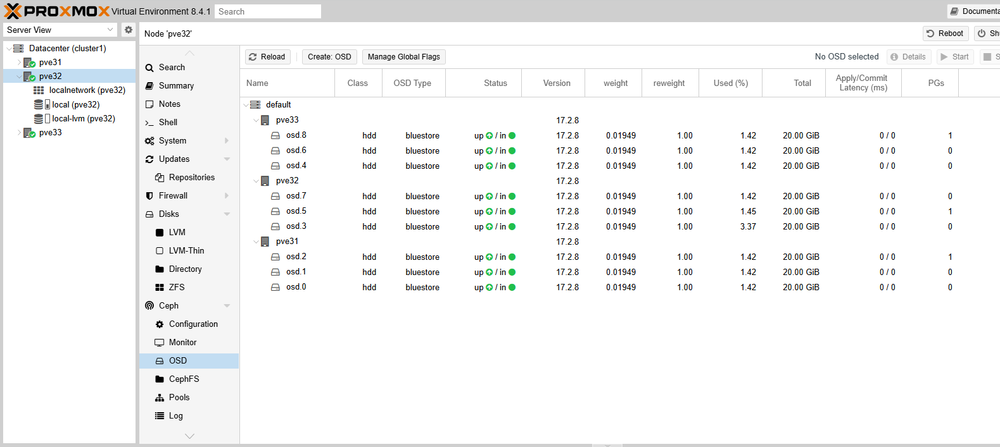

# Create VMs

I have uploaded an ISO, in this sequence I will create a first VM. Click on the button in the top right corner.

<figure><figcaption></figcaption></figure>

I still have only one node called **pve21**.

<figure><figcaption></figcaption></figure>

I will name my VM as **ub2204-server**, this is my code for a gold image. Then I click **next**.

<figure><figcaption></figcaption></figure>

I select **local** as my storage and I select the ISO file I uploaded previously. Then I click **next**.

<figure><figcaption></figcaption></figure>

Under **System** I leave the defaults, but enable **Qemu agent**, to allow the VM to communicate with the Host.

Under **Disks**, I leave the defaults.

<figure><figcaption></figcaption></figure>

Under **CPU** and **Memory**, I leave the defaults.

<figure><figcaption></figcaption></figure>

Under **Network**, I leave the default. This will connect the VM to the same bridge as the management interface. OK for the test!

<figure><figcaption></figcaption></figure>

Finally, I record all my settings.

<figure><figcaption></figcaption></figure>

I have ticked **Start after created**. I click **Finish**.

I can see the VM has been created.

<figure><figcaption></figcaption></figure>

And now I can start it and install the guest OS.

<figure><figcaption></figcaption></figure>

I am not going to document the install, I presume you know how to do this! However, its best to install minimums of everything.
